# Revels

The official iOS Application for the National Fest of Manipal Institute of Technology.
Revels 2020.

---

### Screenshots

<p float="left">
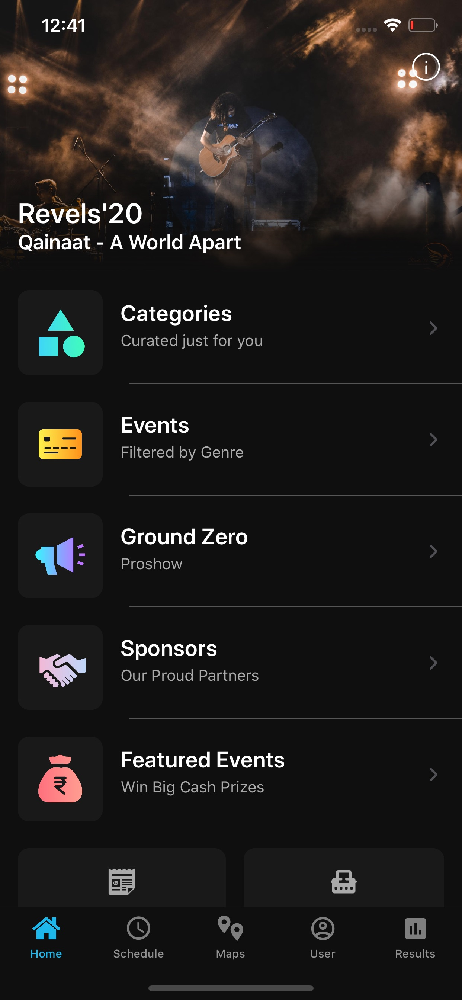
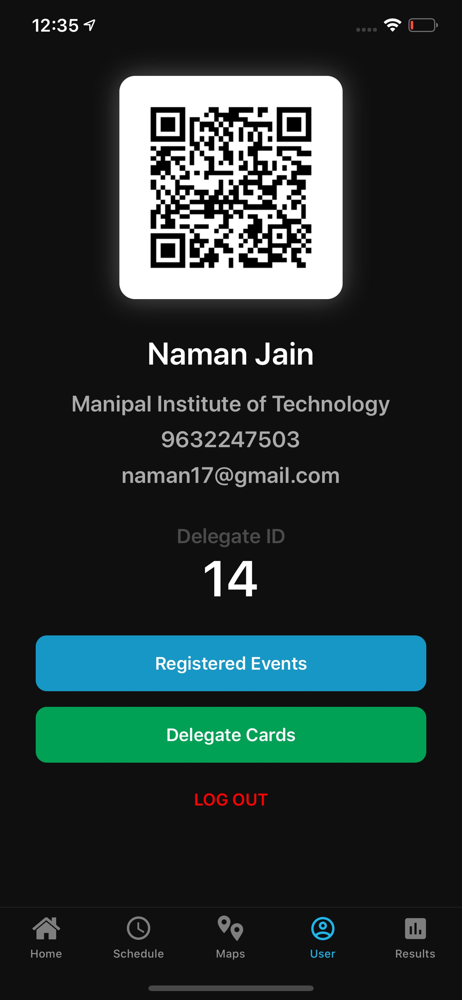
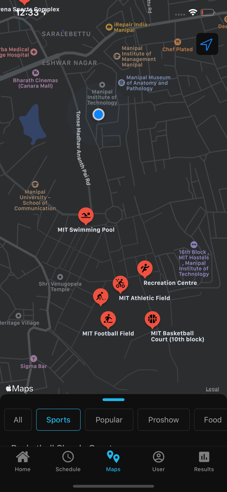
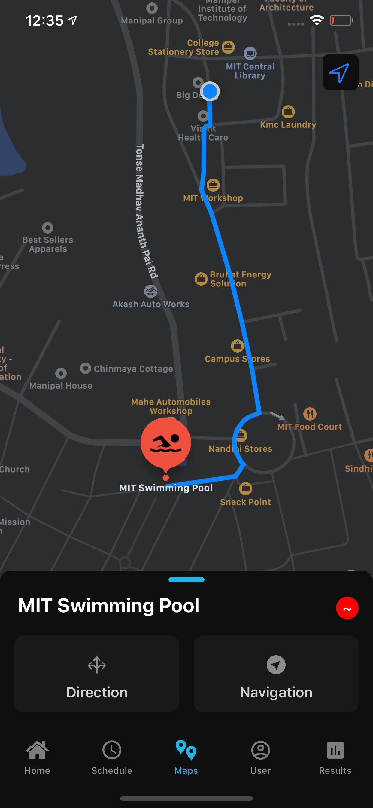

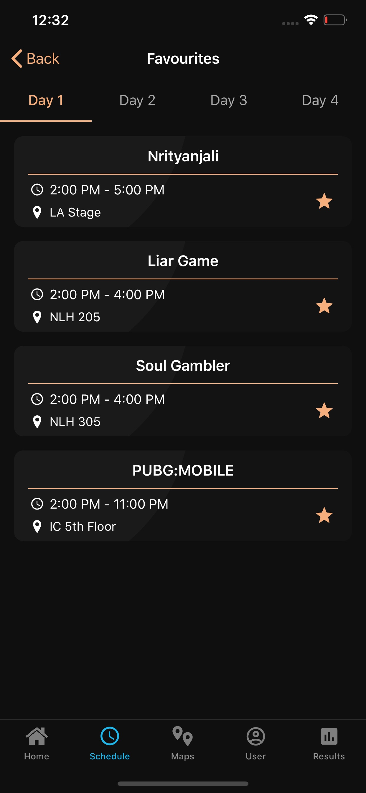
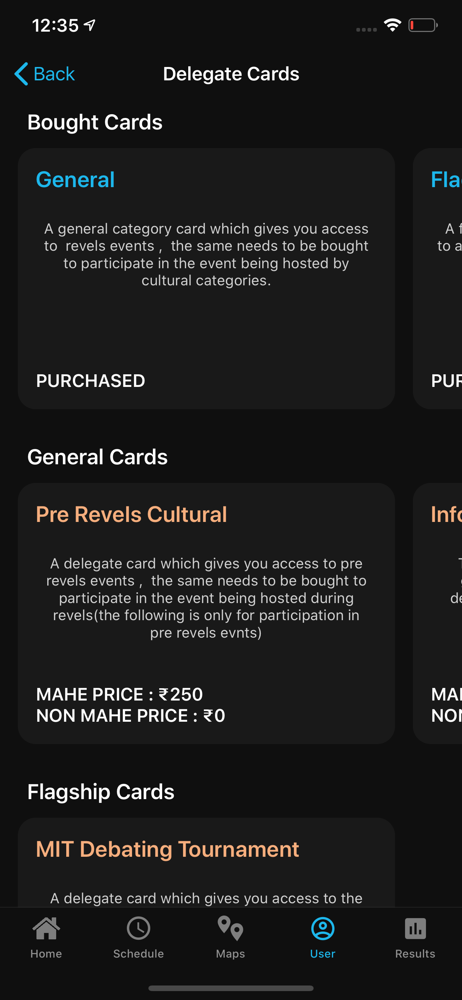
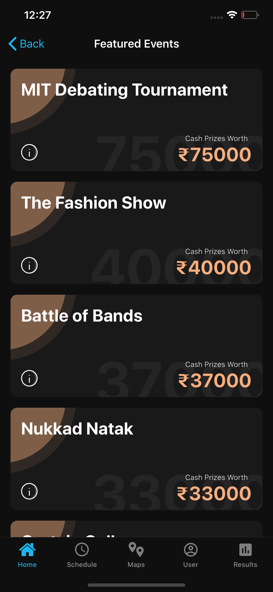
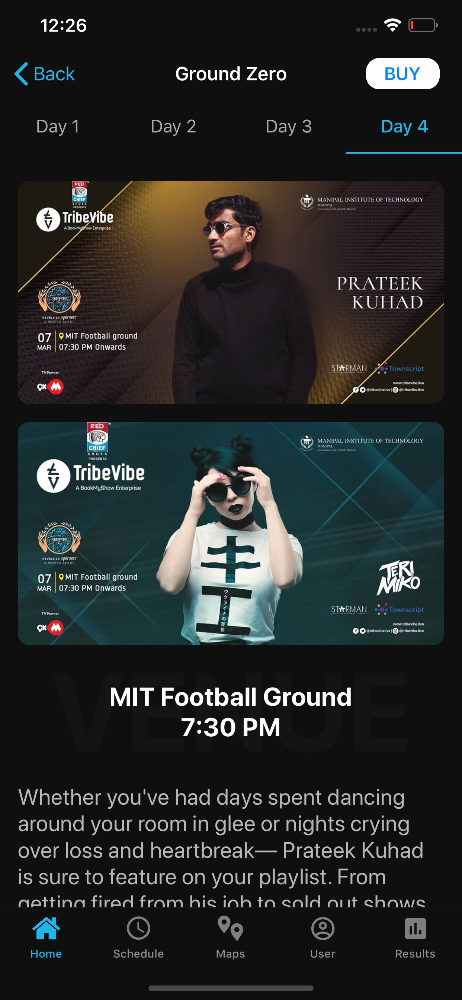
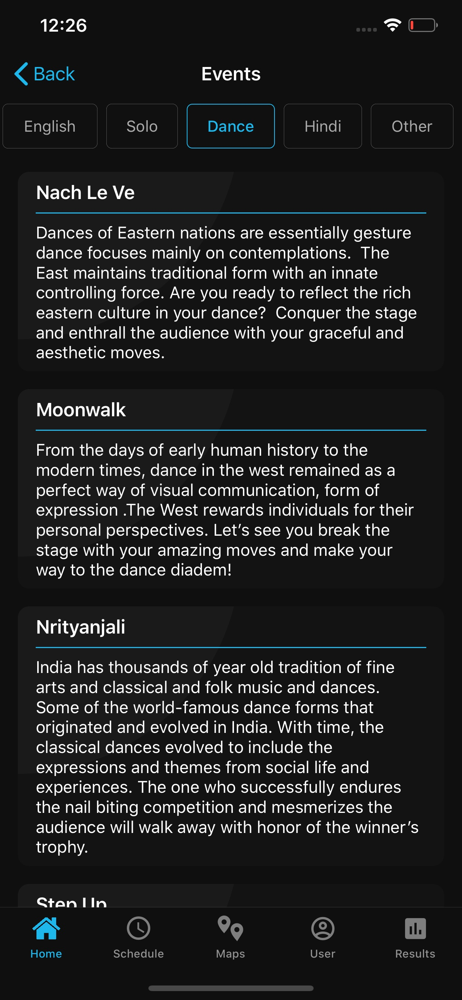
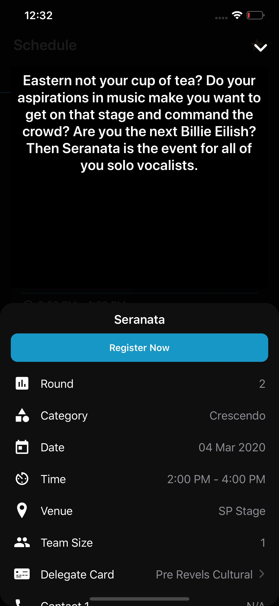
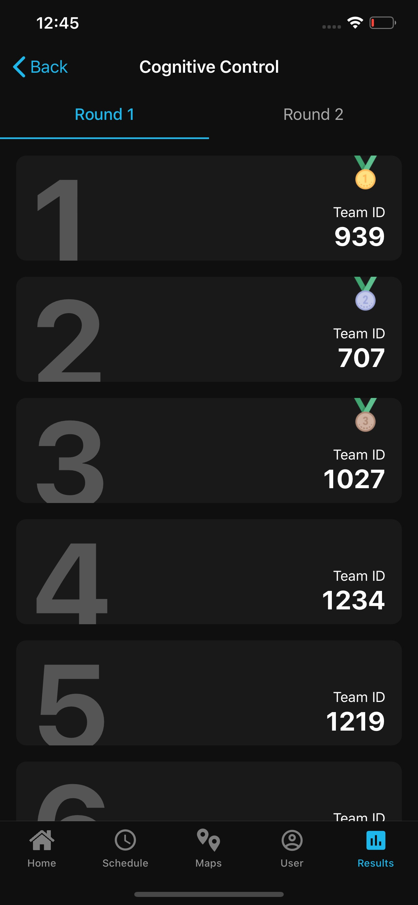
</p>


### Installation

1. Clone the repo via git clone command.
```
https://github.com/naman17/Revels.git
```
2. Run the following command to install all the third-party libraries.
```
pod install
```
3. Open in Xcode
```
open Revels-20.xcworkspace
```
```
Build and Run
```
Server Access Token

```
**Server Access Token**
contact the developer for the token key
replace token in Secrets.swift
```


**Note:
This app was officially developed for Manipal Institute of Technology.
Chances are it may not be fully functional and may not load the dynamic content due to the changes in the APIs and architecture.**

### Download
App is available on App Store. You can donwload on your iOS device from [here](https://apps.apple.com/in/app/revels20/id1500173604).

<!-- ### Coding standards

Followed the following guides and code standards:
[Swift Style Guide](https://github.com/linkedin/swift-style-guide) -->
